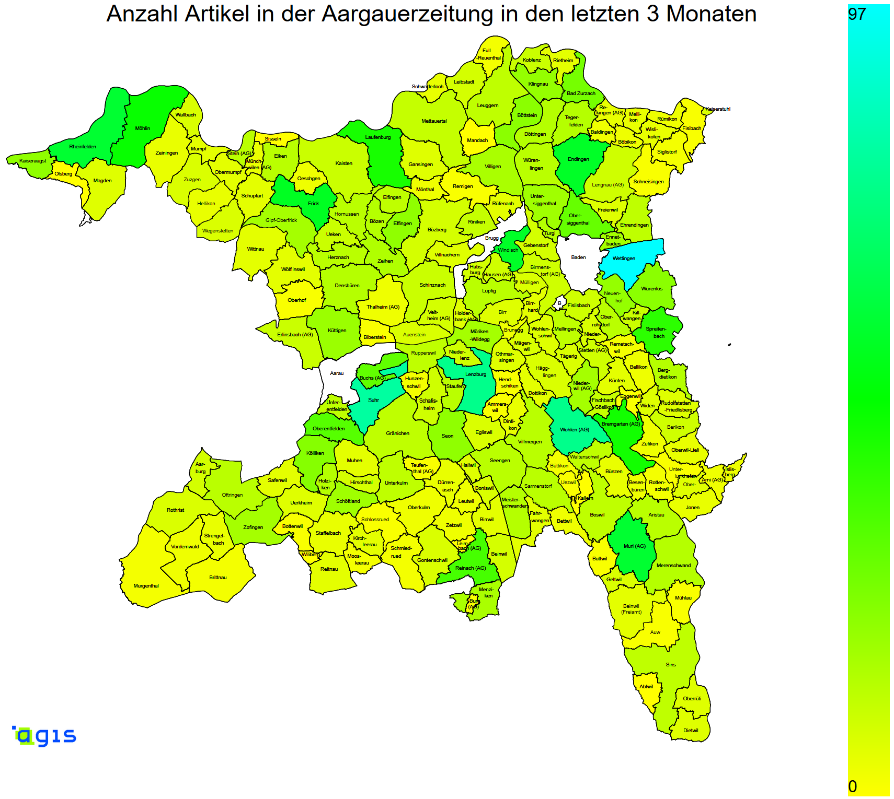

# AZ-Crawler
Ein Skript, welches die Artikel auf aargauerzeitung.ch crawlt, und die Anzahl der Artikel pro Gemeinde auf einer Karte visualisiert.

Dieses Skript is meine persönliche Arbeit für das Modul `matl` an der FHNW.

## Funktionsweise

In einem ersten Schritt werden alle benötigten Daten von der JSON-API der Aargauerzeitung heruntergeladen.
Diese Artikel werden dann zum jeweiligen Teil der Vektorgrafik in  `data/map.html` zugewiesen, und der Teil wird mit einer Farbe, basierend auf der Anzahl Artikel über diese Gemeinde eingefärbt, was mit Javascript umgesetzt wurde.

Da für Aarau, Brugg und Baden eine sehr grosse Anzahl an Artikeln veröffentlich wurde, werden diese nicht speziell eingefärbt. Diese Einstellung kann in `config.py` angepasst werden.

## Skript ausführen
Es wird empfohlen das Skript mit anacodna auszuführen. Eine Anaconde Environment ist im Repository enthalten.
Dieses kann wie folgt aktiviert werden:

`conda env create -f conda-environment.yaml`

`conda activate spoorey-azcrawler`

Anschliessend können folgende Skripts ausgeführt werden:
1. `python crawl-cities.py` Alle Ortschaften lokal speichern
2. `python crawl-news.py` Die benötigten Artikel cachen
3. `python visualize-articles.py` Anzahl Artikel visualiseren. Mit den Argumenten `blue` und `sqrt` (siehe `colorcodes.py`) kann die färbung angepasst werden: `python visualize-articles.py blue`

Danach `vendor/map.html` im browser öffnen.

## Dateistruktur
### `cache` Ordner
Alle von der aargauerzeitung API bezogenen Daten oder vom Skript erstellten Dateien werden hier gecacht
### `data` Ordner
Enthält die Daten, die zur erstellung der Karte benötigt werden (`vendor/map.html`). Dies beinhaltet das skript, welches verwendet wurde um die Namen der Ortschaften den jeweiligen Teilen der Vektorgrafik zuzuordnen (`data/map-names-and-ids.js`) sowie das manuell korrigierte Resultat dieser Zuweisung (`data/names-and-ids.json`)
### `vendor/map.html`
Dies ist eine konvertierte [vektor Datei](https://www.ag.ch/de/dfr/geoportal/themenkarten/download/Kartendownload.jsp) welche vom Kanton Aargau zur Verfügung gestellt wurde.
### `colorcodes.py`
Beinhaltet Funktionen zum Berechnen der Farbe der jeweiligen Ortschaften auf der Karte, basierend auf Artikelzahlen.
### `conda-environment.yaml`
Das anaconda environment welches für diese Skripts verwendet wird.
### `config.py`
Beinhaltet grundlegende Konfigurationen.
### `crawl-cities.py`
Lädt alle Ortschaften aus der API der AZ.
### `crawl-news.py`
Lädt alle benötigten Artikel aus der API der AZ.
### `visualize-articles.py`
Erstellt ein Javscript zum einfärben der Karte.
